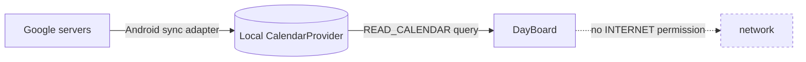
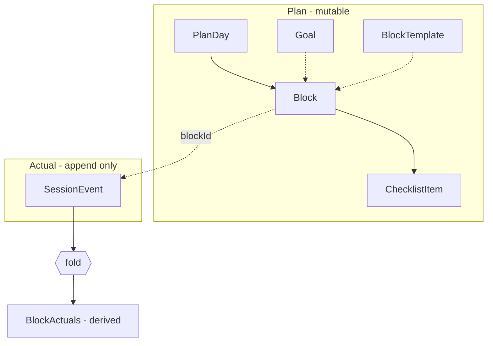
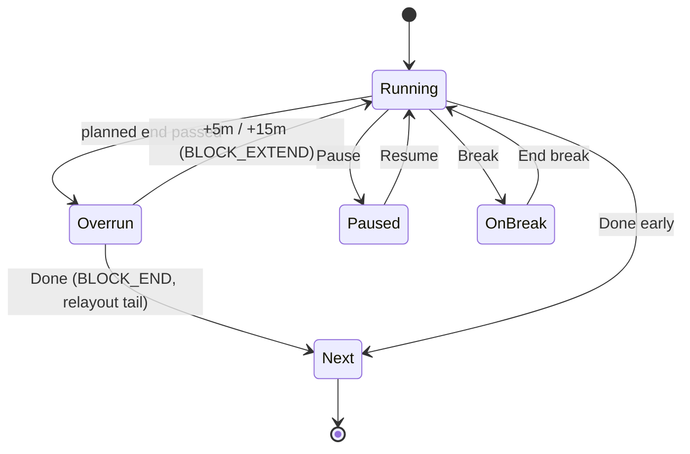
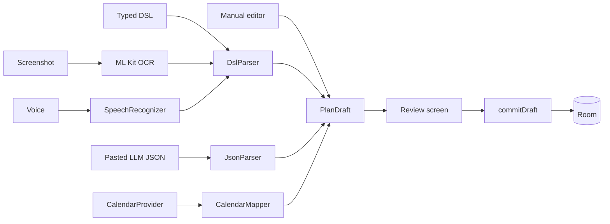

# DayBoard — Offline Routine Board for Android Tablet

**Architecture & Structure Spec** · 2026-09-20 · @Someone

## 1. What this is, and the five principles

A single-screen, always-on **time board** for a tablet that sits beside you while you work. It shows the clock, the block you are in, how much of it is left, that block's checklist, what is next, and an honest ledger of where the day actually went.

It is not a task manager and not a calendar. It is a dashboard for the current hour. Every decision below serves that.

### P1. Plan and actual are separate data

The plan is mutable state you edit. What happened is an append-only event log. You never overwrite the plan to record progress.

Every "how long did I really work" number is a pure fold over that log. This one decision removes most of the bugs a timer app normally has, and lets you fix a metric later and get correct history retroactively.

### P2. The engine is pure Kotlin

`resolve(plan, events, now) -> BoardState` has no Android imports, no coroutines, no database. It runs in a JVM unit test in microseconds.

The UI is a dumb renderer of `BoardState`. Get this boundary right and you can rewrite the whole UI later without touching logic.

### P3. Six inputs, one write path

Manual entry, typed DSL, pasted LLM JSON, calendar, OCR screenshot and voice all produce the same `PlanDraft`. A draft is never live. It passes through one Review screen and one commit function.

### P4. No network, enforced structurally

The app does not declare `android.permission.INTERNET`. Not "we choose not to call the network" but the OS will not permit it, and a CI test asserts the merged manifest stays that way.

Calendar data comes from Android's already-synced local `CalendarContract` provider. That is what makes the privacy claim real rather than a README promise.

### P5. Honest about what it does not know

When you leave the desk, the app does not guess. Time that is neither logged focus nor logged break is reported as **untracked**, in its own bucket, with no spin. An app that quietly counts a bathroom trip as deep work is worse than useless.

## 2. Stack and hard constraints

Kotlin, Jetpack Compose, Room, no network. Nothing else is load-bearing.

| Choice | Decision | Why |
| --- | --- | --- |
| Language | Kotlin, `minSdk 26`, `targetSdk 36` | API 26 gives `java.time` natively, no desugaring |
| UI | Jetpack Compose + Material 3 | One screen that redraws once a second; Compose handles that well if state is hoisted |
| Persistence | Room (SQLite) | Indexed queries over the event log; no ORM ceremony |
| Async | Coroutines + Flow | The tick and the DB are both flows; the board is one `collectAsStateWithLifecycle` |
| DI | Manual `AppContainer` | Hilt costs build time, APK size and annotation processing for \~12 objects. Not worth it here |
| Navigation | Two destinations, plain state | You have Board and Editor. A nav library is overkill |
| OCR | ML Kit Text Recognition v2, **bundled** Latin model | The unbundled model is fetched by Play Services; bundled keeps you self-contained. Costs \~4 MB |
| Serialization | kotlinx.serialization | For the LLM JSON path and export |
| Charts/stats | Hand-drawn Compose `Canvas` | A chart library for two bar charts is dead weight |

### What you deliberately do not add

No Firebase, no analytics, no crash reporting SDK, no WorkManager, no Retrofit/OkHttp, no image loader, no Hilt. If you want crash logs, use ACRA writing to a local file, or nothing.

### The offline constraint, resolved

You asked for Google Calendar import *and* no internet. Those are compatible, because you do not talk to Google.

Android's calendar sync adapter already pulls your Google Calendar into a local SQLite provider. You query `CalendarContract.Instances` with `READ_CALENDAR`. Data arrives over a connection your app never makes and never sees.



### Size budget

| Build | Target APK |
| --- | --- |
| Core app, no OCR | under 6 MB |
| With bundled ML Kit OCR | under 12 MB |

Enforce with R8 full mode, resource shrinking, and a Gradle task that fails the build if the release APK exceeds the ceiling. Ship OCR as a separate product flavour so people who do not want it get the small build.

## 3. Data model

Two halves that never mix: five plan tables you edit, one event table you only append to.



### Plan side

```kotlin
@Entity
data class PlanDay(
    @PrimaryKey val id: Long = 0,
    val date: LocalDate,
    val zoneId: String,           // frozen at creation; DST-safe
    val source: PlanSource,       // MANUAL, DSL, LLM_JSON, CALENDAR, OCR, VOICE
    val createdAt: Instant
)

@Entity(indices = [Index("planDayId", "orderIndex")])
data class Block(
    @PrimaryKey val id: Long = 0,
    val planDayId: Long,
    val title: String,
    val notes: String? = null,
    val kind: BlockKind,          // FOCUS, BREAK, MEAL, FIXED_EVENT, BUFFER
    val anchor: Anchor,           // FIXED(startLocal) or FLOW
    val startLocal: LocalTime?,   // non-null only when anchor == FIXED
    val plannedMinutes: Int,
    val minMinutes: Int?,         // floor for COMPRESS overflow policy
    val overflow: OverflowPolicy, // PUSH, COMPRESS, TRUNCATE, SPILL
    val colorRole: ColorRole,
    val goalId: Long? = null,
    val orderIndex: Int
)

@Entity(indices = [Index("blockId", "orderIndex")])
data class ChecklistItem(
    @PrimaryKey val id: Long = 0,
    val blockId: Long,
    val text: String,
    val orderIndex: Int
    // note: NO doneAt field. Done-ness lives in the event log.
)

@Entity
data class Goal(
    @PrimaryKey val id: Long = 0,
    val title: String,
    val targetMinutesPerWeek: Int?,
    val colorRole: ColorRole,
    val archived: Boolean = false
)

@Entity
data class BlockTemplate(          // "Gym 60m", "Deep work 90m" for one-tap reuse
    @PrimaryKey val id: Long = 0,
    val title: String,
    val kind: BlockKind,
    val plannedMinutes: Int,
    val checklistJson: String?
)
```

The missing `doneAt` on `ChecklistItem` is deliberate. Ticking a box is an event, so you get the timestamp, the undo, and the "you checked three of five items in that block" stat for free.

### Actual side

```kotlin
@Entity(indices = [Index("blockId"), Index("wallAt")])
data class SessionEvent(
    @PrimaryKey val id: Long = 0,
    val blockId: Long?,           // null for day-level events
    val type: EventType,
    val wallAt: Instant,          // for ordering and display
    val elapsedRealtime: Long,    // SystemClock.elapsedRealtime(), for durations
    val bootId: String,           // groups elapsedRealtime values from one boot
    val refId: Long? = null,      // checklist item id, etc.
    val meta: String? = null      // small JSON blob
)

enum class EventType {
    BLOCK_START, BLOCK_END, BLOCK_SKIP, BLOCK_EXTEND,
    PAUSE, RESUME,
    BREAK_START, BREAK_END,
    AWAY_START, AWAY_END,
    ITEM_CHECK, ITEM_UNCHECK,
    DAY_START, DAY_END
}
```

`bootId` matters. `elapsedRealtime()` resets to zero on reboot, so a duration computed across a reboot is garbage. Store a per-boot UUID (regenerated when `elapsedRealtime` goes backwards) and refuse to subtract across boot boundaries, falling back to `wallAt` with a `low_confidence` marker.

### Derived, never stored as truth

```kotlin
data class BlockActuals(
    val plannedMs: Long,
    val focusedMs: Long,
    val breakMs: Long,
    val untrackedMs: Long,
    val overrunMs: Long,
    val itemsDone: Int,
    val itemsTotal: Int,
    val confidence: Confidence   // FULL, PARTIAL (reboot or clock change seen)
)
```

`BlockActuals` is computed by `foldEvents(events): BlockActuals`, a pure function. Cache it in a `BlockRollup` table written once when a day closes, purely so the history screen does not refold 400 days of events on every scroll. The rollup is a cache, never the source of truth, and a version column lets you invalidate and refold it after a logic fix.

### Retention

Events are tiny, roughly 60 bytes each and maybe 80 a day. Ten years is under 200 MB even with indices, so keep everything by default. Offer a settings toggle to prune raw events older than N months once their rollup exists.

## 4. The timeline engine

Real routines mix two kinds of block, and most planner apps only model one. That is why they feel wrong.

| Kind | Behaviour | Examples |
| --- | --- | --- |
| **FIXED** | Pinned to the wall clock. Cannot drift | Class at 10:00, gym slot, a call, calendar events |
| **FLOW** | Starts when the previous block ends | Read the paper, email professors, revise a subject |

A fixed block is an **anchor**. Flow blocks are laid out in the gaps between anchors. Overrun in a flow block is normal and expected; overrun into an anchor is a conflict that needs a policy.

### The sweep

```kotlin
fun layout(blocks: List<Block>, dayStart: LocalTime): List<ResolvedBlock>
```

1. Sort by `orderIndex`. Order, not time, is what the user edited.
2. Walk once, carrying a `cursor: LocalTime` starting at `dayStart`.
3. **FIXED block**: if `cursor > block.startLocal`, the preceding flow run has overflowed. Apply that run's overflow policy, then set `cursor = block.startLocal`. Emit the block. `cursor += plannedMinutes`.
4. **FLOW block**: emit at `cursor`, then `cursor += plannedMinutes`.
5. Emit any residual conflicts alongside the result.

That is `O(n log n)` for the sort and `O(n)` for the walk, with `n` around 20. Do not reach for a constraint solver.

### Overflow policies

When a run of flow blocks does not fit before the next anchor, each block's declared policy decides:

| Policy | Effect | Good default for |
| --- | --- | --- |
| `COMPRESS` | Shrink the run proportionally, never below `minMinutes` | Study blocks with soft edges |
| `PUSH` | Keep durations, cascade past the anchor, mark it conflicted | When the anchor is soft (a reminder, not an appointment) |
| `TRUNCATE` | Cut the last block at the anchor | Reading, browsing, anything interruptible |
| `SPILL` | Consume an adjacent `BUFFER` block first, then fall back to `COMPRESS` | The realistic default if you put buffers in the day |

Make `SPILL` the app default and teach the plan format to insert a 15-minute `BUFFER` before every anchor. Slack in the plan is what makes it survive contact with a real day.

### Live overrun, which is different

Layout happens when a plan is committed. **Overrun happens while you sit there.** Do not silently re-layout the day under the user, because the board changing by itself is disorienting.

When the active block passes its planned end, the board shows an amber state and three buttons:



Extending emits `BLOCK_EXTEND` and re-runs the sweep for the remaining blocks only. Blocks already finished are untouched: their record is in the event log, and the log is never re-laid-out.

After five minutes of overrun with no interaction, escalate once with a chime and a notification, then stop. No nagging loop.

### The public surface

```kotlin
// core:domain — zero Android imports
fun resolve(
    plan: ResolvedPlan,
    events: List<SessionEvent>,
    now: Instant,
    zone: ZoneId
): BoardState

data class BoardState(
    val clock: ZonedDateTime,
    val current: ActiveBlock?,      // null before day start / after day end
    val next: ResolvedBlock?,
    val later: List<ResolvedBlock>, // next 2-3 only
    val completed: List<CompletedBlock>,
    val dayTotals: DayTotals,
    val ribbon: List<RibbonSegment>,
    val nudge: Nudge?,              // rest suggestion, overrun warning
    val conflicts: List<Conflict>
)
```

One function, one struct, fully testable with an injected `Clock`. Write the tests for this before you write any UI.

## 5. Clocks and ticking

This is the section that separates a timer app that works from one that is subtly wrong for months. Two rules.

### Rule 1: two clocks, never mixed

| Clock | Use for | Breaks when |
| --- | --- | --- |
| `Instant.now()` wall clock | Scheduling, display, "is it 14:30 yet" | User changes clock, DST, NTP correction |
| `SystemClock.elapsedRealtime()` monotonic | **Every duration**: focus time, break length, overrun | Reboot (resets to 0) |

Compute "how long was this block" from `elapsedRealtime` deltas. Compute "when does the next block start" from the wall clock. Mixing them is the number one bug in this category: a DST shift or a manual clock change turns a 25-minute session into a 3-hour-25-minute session, and the history is silently corrupt forever.

Store both on every event, as in the model above. When a reboot is detected mid-block, fall back to the wall-clock delta and mark that block `Confidence.PARTIAL` so the stats screen can show it honestly.

### Rule 2: a self-correcting tick

The naive tick drifts and ticks off-phase, so the clock visibly stutters and skips a second every minute or so:

```kotlin
// WRONG
while (true) { emit(Instant.now()); delay(1000) }
```

Sleep to the next wall-clock boundary instead. This stays phase-locked to the real second indefinitely, and self-heals after any scheduling hiccup:

```kotlin
fun tickFlow(periodMs: Long): Flow<Instant> = flow {
    while (currentCoroutineContext().isActive) {
        val now = System.currentTimeMillis()
        emit(Instant.ofEpochMilli(now))
        val next = ((now / periodMs) + 1) * periodMs
        delay((next - System.currentTimeMillis()).coerceAtLeast(1))
    }
}
```

### Tick rates by what is on screen

| State | Rate | Why |
| --- | --- | --- |
| Active, seconds shown | 1 Hz | The countdown moves |
| Active, ambient mode | 1/60 Hz (minute boundary) | Nothing sub-minute is visible |
| No active block | 1/60 Hz | Only the clock moves |
| Screen off / backgrounded | 0, flow cancelled | `AlarmManager` handles boundaries |

Drive this from `lifecycle.repeatOnLifecycle(STARTED)` so the flow dies with the screen, and switch rates by `flatMapLatest` on the display mode. A tablet on a stand should not be waking the CPU once a second to redraw nothing.

### Time-change events

Register a receiver for `ACTION_TIME_CHANGED`, `ACTION_TIMEZONE_CHANGED` and `ACTION_DATE_CHANGED`. On any of them: reload the plan, re-run `layout`, reschedule the next alarm, and if a block is active append a `meta` note to the log. Do not attempt to "correct" past events; the monotonic durations are already right.

Freeze `zoneId` on `PlanDay` at creation. A plan made in IST stays an IST plan even if you carry the tablet somewhere else, which is the behaviour people actually expect.

## 6. Input pipeline

Six ways in, one shape, one review, one commit. This is the highest-leverage structural decision in the app: it means adding a seventh importer later costs one file.



```kotlin
interface PlanImporter<in Input> {
    fun parse(input: Input): ImportResult
}

sealed interface ImportResult {
    data class Ok(val draft: PlanDraft, val warnings: List<Warning>) : ImportResult
    data class Failed(val errors: List<ParseError>) : ImportResult
}

data class ParseError(val line: Int?, val span: IntRange?, val message: String)
```

Nothing in this pipeline writes to Room except `commitDraft`. No importer touches the DAO.

### 1. Manual editor

A list of blocks with drag-to-reorder and a duration stepper. Not a calendar grid: dragging rectangles on a timeline is fiddly on a tablet and slow to build. One-tap `BlockTemplate` insertion covers most repeat entry.

### 2. Typed DSL (build this first)

A deterministic line grammar. No LLM, no ambiguity, fast to type on a tablet keyboard.

```
09:00-09:30 Email professors #deep
  - Mail Dr. Puhan
  - Reply to lab thread
  - Follow up with 3 more
09:30 45m Read Facial-R1 paper #research
= 15m buffer
! 17:30 60m Gym
~ 10m break
```

| Prefix | Meaning |
| --- | --- |
| `HH:MM-HH:MM` | Fixed anchor with explicit end |
| `HH:MM 45m` | Fixed anchor with duration |
| `45m Title` | Flow block, starts when the previous ends |
| `!` | Force `FIXED` (hard appointment) |
| `=` | `BUFFER` block |
| `~` | `BREAK` block |
| `#tag` | Maps to a `Goal` by name, created if new |
| Two-space indent ` -  ` | Checklist item on the block above |

Hand-write this parser. It is about 150 lines, it gives exact line and column errors, and it is the target that OCR and voice both compile down to.

### 3. Pasted LLM JSON

The app ships a prompt template with a copy button. You paste it into any AI, paste the JSON back, and the app validates it. The schema and prompt text are in the appendix.

Be lenient on input: strip markdown code fences, tolerate trailing commas, accept `"30m"` / `"30 min"` / `30` for durations, accept `"9am"` / `"09:00"` / `"9:00 AM"` for times. LLM output is not clean and you should not punish the user for that. Be strict on what you then show in Review.

### 4. Calendar

Query `CalendarContract.Instances` for `[dayStart, dayEnd)`. Let the user pick which calendar IDs to include and persist that choice. Map every event to `kind = FIXED_EVENT, anchor = FIXED`, since calendar entries are appointments by nature. All-day events become day-level notes, not blocks.

### 5. Screenshot OCR

ML Kit returns blocks with bounding boxes. Sort by `boundingBox.top`, then `left`, with a line-grouping tolerance of roughly half the median glyph height. Join into lines, then feed straight into the DSL parser.

Never commit OCR output directly. Route it to Review with low-confidence tokens highlighted so a misread `0` for `O` gets caught in one glance.

### 6. Voice

`SpeechRecognizer` with `EXTRA_PREFER_OFFLINE = true`, then the DSL parser over a normalisation pass ("nine thirty to ten" becomes `09:30-10:00`, "for forty five minutes" becomes `45m`).

Flag, honestly: on-device recognition quality varies a lot by device and installed language pack, and some tablets will fall back to network recognition or simply fail. Since the app has no `INTERNET` permission, a network fallback cannot happen; recognition just returns an error. Treat voice as a convenience that degrades to the keyboard, and build it last.

### The Review screen

One screen, always shown before commit, for every source including manual. It displays the laid-out timeline, flags conflicts with one-tap fixes, shows total planned hours against waking hours, and warns on zero-buffer days. **Commit** is the only write.

## 7. The Board screen

Designed for a 10 to 11 inch tablet in landscape, read at arm's length with a glance of under two seconds. Everything is sized for that distance, so it is roughly 1.5x larger than normal app typography.

```
┌──────────────────────────────────────────────────────────────┐
│  14:32                                  Sun 20 Sep · Day 3/7 │   clock ~140sp
├──────────────────────────────────────────────────────────────┤
│  NOW   Email professors                          18:42 left  │   title 48sp, timer 72sp
│  ████████████████████████░░░░░░░░░░░░░░░                     │
│  ☑ Mail Dr. Puhan    ☐ Reply to lab thread   ☐ 3 more        │   tap to tick
├───────────────────────────────┬──────────────────────────────┤
│ NEXT   Read Facial-R1 paper   │  TODAY                       │
│ in 18:42 · 45m                │  Focus      2h 40m           │
│                               │  Break        20m            │
│ THEN   Gym · 17:30 · 60m      │  Untracked    10m            │
│                               │  ▓▓▓▓▓▓░░░░  3h 10m / 8h     │
├───────────────────────────────┴──────────────────────────────┤
│  ⏸ Pause      ☕ Break      +5m      ✓ Done → Next           │   min 72dp targets
├──────────────────────────────────────────────────────────────┤
│ ▐▓▓▓▓▐░░▐▓▓▓▓▓▓▓▓▐███▐▓▓▓▓▐░░░░▐▓▓▓▓▓▓▐  ▲now                │   day ribbon
└──────────────────────────────────────────────────────────────┘
```

### The day ribbon

The strip at the bottom is the single best element here and the one most planner apps lack. It is the waking day, roughly 06:00 to 23:00, as proportional coloured segments with a "now" needle.

Completed segments render solid, the current one pulses faintly, upcoming ones are dimmed. One glance gives you the entire shape of the day without reading a word. Draw it in a single Compose `Canvas` with `drawRect` calls, which is one draw node and effectively free to redraw.

### Which number goes big

**Time remaining**, not elapsed. The remaining number is the one that drives a decision (do I start the next email or not). Elapsed is retrospective and you cannot act on it mid-block.

The bar's fill communicates elapsed proportion visually, so you get both channels without two competing numbers. On overrun, the timer flips to amber and reads `+3:12 over`.

### Rendering rules for always-on

| Concern | Rule |
| --- | --- |
| Burn-in | True black background; shift the whole content tree by a random ±3dp every 60s; no static bright rectangle anywhere |
| Recomposition | Hoist the tick into a `State<Instant>` read only inside the clock and timer composables, so a second's tick redraws two text nodes, not the tree |
| Progress bar | `Modifier.drawBehind` reading a `State<Float>`, never a recomposed `LinearProgressIndicator` with a changing parameter |
| Ambient | After 3 minutes untouched, fade to clock + current title + countdown only, at 25% brightness |
| Night | Auto-dim by time or ambient light sensor; amber-shifted palette after 21:00 |
| Screen on | `WindowCompat` keep-screen-on flag while the Board is foreground, not a `WAKE_LOCK` |

### Interaction budget

Every common action is one tap at a 72dp target: tick an item, pause, start a break, extend five minutes, finish and advance. Editing the plan is deliberately two taps deeper, behind a corner button, so you cannot fat-finger your day away while reaching for the tablet.

Support portrait by stacking the two middle panes vertically, but optimise for landscape. A board lives on a stand.

## 8. Breaks, nudges and the away-time ledger

### Nudges, not forced Pomodoros

You said you do not want a rigid five-minute break forced after every timer. So the app never auto-starts a break and never blocks the screen.

After a configurable stretch of continuous focus (default 50 minutes), a small amber chip appears in a corner: `Been 50m. Stretch?` It is non-modal, tap to start a break, swipe to dismiss, auto-fades after 30 seconds. If dismissed, it does not reappear for another full interval. The whole feature can be switched off.

### The break timer

`☕ Break` is permanently on the button bar. Tapping it opens four chips and nothing else:

| Chip | Emits | Purpose |
| --- | --- | --- |
| Walk 10m | `BREAK_START` meta `walk` | The nudge's usual answer |
| Toilet 5m | `BREAK_START` meta `bio` | Short, frequent, worth its own tap |
| Meal 30m | `BREAK_START` meta `meal` |  |
| Custom | `BREAK_START` meta `custom` | Stepper |

During a break the board flips to a calm break face: break countdown big, the block it interrupted small, and one `Resume` button. The parent block's focus accounting is suspended, not stopped, so returning continues the same block.

Break overrun is reported plainly, without judgement language: `Break 10m planned · 24m taken`.

### The away-time ledger

This is the honest-accounting piece. Four buckets per block, and they always sum to elapsed time.

```latex
elapsed = focused + break + untracked
```

| Bucket | Definition |
| --- | --- |
| **focused** | Block active, not paused, not on break, app foregrounded, screen on |
| **break** | Between an explicit `BREAK_START` and `BREAK_END` |
| **untracked** | Everything else. Derived by subtraction, never measured |
| **overrun** | `elapsed − plannedMinutes`, when positive |

`untracked` is a residual, not a detection. That is the whole point: the app does not know what you were doing, so it does not claim to. It just shows you the size of the hole.

### How away is detected

Cheapest signals only, in this order:

1. `Lifecycle.Event.ON_STOP` on the Board, meaning you switched apps. Emit `AWAY_START`.
2. `ACTION_SCREEN_OFF` broadcast. Emit `AWAY_START`.
3. No touch for N minutes while the screen is on and a block is active. Soft signal, logged with lower confidence.

**Explicitly rejected:** camera-based presence detection, microphone activity, usage-stats snooping on other apps, accelerometer inference. Each is a battery cost, a permission the app does not need, and a privacy story you would then have to defend in a README. The subtraction approach gets you 90% of the value at zero cost.

### The end-of-block card

When a block closes, show a three-second summary before advancing, dismissible by tap:

```
Email professors
planned 30:00  ·  focused 22:10  ·  break 4:00  ·  untracked 3:50
3 of 5 items done
```

This is the feedback loop that makes the whole app worth running. Over a week the untracked column tells you more about your day than any productivity score would.

## 9. Alerts and background behaviour

### No foreground service in v1

The obvious instinct is a foreground service so timers keep running. Resist it. Your use case is a tablet on a stand with the screen on and the app in front, so the Board's own lifecycle scope is sufficient. A service buys you nothing there and costs a permanent notification, an Android 14+ `foregroundServiceType` justification, and a Play Store review argument.

Because durations are reconstructed from the event log rather than from a running counter, **nothing is lost when the process dies.** On relaunch you fold the log and the timer is exactly where it should be. That is P1 paying for itself.

Add an optional foreground service in v2 only if you want the board to keep announcing transitions while you use other apps.

### Schedule one alarm, not forty

Compute the next boundary from `BoardState`, set a single exact alarm, and on fire, reschedule the next one.

```kotlin
alarmManager.setExactAndAllowWhileIdle(
    AlarmManager.RTC_WAKEUP,
    nextBoundary.toEpochMilli(),
    pendingIntent
)
```

Reschedule on: app start, `BOOT_COMPLETED`, plan commit, any block extend or skip, and any time-change broadcast.

| Boundary | Alert |
| --- | --- |
| Block start | Chime + optional TTS "Starting: read the paper" |
| T-2 minutes | Soft tick, visual only in ambient |
| Block end | Chime + notification if backgrounded |
| Break end | Chime, stronger than block end |
| 5 min overrun | One escalation, then silence |

### Permissions for exact alarms

Android 13+ needs `SCHEDULE_EXACT_ALARM` or `USE_EXACT_ALARM`. A timer app is one of the categories Google permits `USE_EXACT_ALARM` for, which is auto-granted and needs no runtime prompt. Flag for later: if you ever publish to Play, that declaration needs a justification in the console. For sideloading and F-Droid it is a non-issue.

### TTS

`TextToSpeech` with the on-device engine, announcing only the block title. Off by default. Never announce checklist contents aloud, since the tablet may not be in a private room.

## 10. Module and package structure

Start with **two Gradle modules**, not six. The split that matters is pure-logic versus Android, because that is what makes the engine testable on the JVM. Splitting further before build times actually hurt is ceremony.

```
dayboard/
├── engine/                        # pure Kotlin/JVM library. NO android deps.
│   └── src/main/kotlin/dev/dayboard/engine/
│       ├── model/
│       │   ├── Block.kt           # Block, BlockKind, Anchor, OverflowPolicy
│       │   ├── PlanDraft.kt       # draft types, Warning, ParseError
│       │   ├── SessionEvent.kt    # EventType, the event shape
│       │   └── BoardState.kt      # BoardState, ActiveBlock, DayTotals, RibbonSegment
│       ├── layout/
│       │   ├── Layout.kt          # the sweep: layout(blocks, dayStart)
│       │   ├── Overflow.kt        # the four policies
│       │   └── Conflict.kt
│       ├── fold/
│       │   ├── EventFold.kt       # foldEvents -> BlockActuals
│       │   └── Confidence.kt      # reboot and clock-change handling
│       ├── parse/
│       │   ├── DslParser.kt       # the line grammar
│       │   ├── JsonPlanParser.kt  # lenient LLM JSON
│       │   ├── TimeTokens.kt      # 9am | 09:00 | 45m | for 45 minutes
│       │   └── OcrLineBuilder.kt  # boxes -> lines (plain data, not ML Kit types)
│       └── Resolve.kt             # resolve(plan, events, now, zone) -> BoardState
│
└── app/                           # Android
    └── src/main/kotlin/dev/dayboard/
        ├── DayBoardApp.kt
        ├── AppContainer.kt        # manual DI, about 30 lines
        ├── data/
        │   ├── db/
        │   │   ├── DayBoardDatabase.kt
        │   │   ├── PlanDao.kt  EventDao.kt  GoalDao.kt  RollupDao.kt
        │   │   └── Entities.kt    # Room mirrors of engine/model
        │   ├── repo/
        │   │   ├── PlanRepository.kt
        │   │   ├── EventRepository.kt    # append-only, no update/delete API
        │   │   └── SettingsRepository.kt # DataStore
        │   ├── calendar/CalendarReader.kt
        │   ├── ocr/MlKitTextSource.kt    # adapts ML Kit to OcrLineBuilder input
        │   ├── voice/SpeechSource.kt
        │   └── backup/JsonBackup.kt      # SAF export and import
        ├── clock/
        │   ├── TickFlow.kt
        │   ├── BootId.kt
        │   └── TimeChangeReceiver.kt
        ├── alarm/
        │   ├── BoundaryScheduler.kt
        │   ├── AlarmReceiver.kt
        │   └── Alerts.kt          # chime, notification, TTS
        ├── ui/
        │   ├── board/
        │   │   ├── BoardViewModel.kt   # tick x plan x events -> BoardState
        │   │   ├── BoardScreen.kt
        │   │   ├── ClockHeader.kt
        │   │   ├── CurrentBlockCard.kt
        │   │   ├── ChecklistRow.kt
        │   │   ├── UpNextPane.kt
        │   │   ├── DayTotalsPane.kt
        │   │   ├── DayRibbon.kt        # single Canvas
        │   │   ├── ActionBar.kt
        │   │   ├── BreakFace.kt
        │   │   └── AmbientOverlay.kt
        │   ├── editor/
        │   │   ├── PlanEditorScreen.kt
        │   │   ├── DslInputScreen.kt
        │   │   ├── ImportSheet.kt      # the six sources
        │   │   └── ReviewScreen.kt     # the one commit path
        │   ├── stats/StatsScreen.kt
        │   └── theme/                  # colors, type scale, day and night
        └── AndroidManifest.xml         # no INTERNET
```

### The one rule that keeps this clean

The `engine` module has no `android.*` and no `androidx.*` import. Add a Gradle check that fails the build if one appears. Everything Android-shaped (ML Kit boxes, `Cursor` rows, Room entities) is adapted at the boundary into plain data classes the engine understands.

When `app` gets uncomfortable, the natural next split is pulling `:data` out of it. Do that when you feel it, not before.

## 11. Performance, permissions, testing, backup

### Permissions, the complete list

| Permission | When | Notes |
| --- | --- | --- |
| `READ_CALENDAR` | Runtime, only if calendar import used | Never requested at launch |
| `RECORD_AUDIO` | Runtime, only if voice used | Phase 5, optional |
| `POST_NOTIFICATIONS` | Runtime, Android 13+ | For boundary alerts when backgrounded |
| `USE_EXACT_ALARM` | Manifest, auto-granted | Alarm/timer category |
| `RECEIVE_BOOT_COMPLETED` | Manifest | Reschedule the next boundary after reboot |

Not present: `INTERNET`, `ACCESS_NETWORK_STATE`, `WAKE_LOCK`, `CAMERA`, `PACKAGE_USAGE_STATS`, any storage permission (SAF needs none).

Write this as a test, not a promise:

```kotlin
@Test fun `app never requests internet`() {
    val perms = parseMergedManifest().usesPermissions
    assertThat(perms).doesNotContain("android.permission.INTERNET")
    assertThat(perms).doesNotContain("android.permission.ACCESS_NETWORK_STATE")
}
```

Put that in CI. It is the single most valuable test in the repo for an app whose pitch is "it cannot phone home".

### Performance targets

| Metric | Target | How |
| --- | --- | --- |
| Cold start to board | under 600 ms | Baseline Profile, no DI graph, lazy stats |
| Frames dropped on tick | 0 | Only two text nodes recompose per second |
| Battery, screen on, 30% brightness | under 2%/hour | Dominated by the panel, not your code |
| Battery, ambient | under 0.8%/hour | 1/60 Hz tick |
| `resolve()` call | under 1 ms | Pure function over \~20 blocks |

Compose specifics that matter here: mark `BoardState` and children `@Stable` or make them fully immutable (`List` from `kotlinx.collections.immutable` if you want the compiler to agree), use `derivedStateOf` for the progress fraction so it only emits on change, and use `Modifier.drawBehind` rather than recomposing the bar.

### Testing

The engine module is where nearly all the tests live, and they run in milliseconds with no emulator.

| Suite | Covers |
| --- | --- |
| `LayoutTest` | Anchors, flow runs, each overflow policy, empty day, single block, back-to-back anchors |
| `EventFoldTest` | Focus/break/untracked sums, pause-resume pairs, unclosed events, reboot mid-block |
| `DslParserTest` | A corpus of about 40 messy real inputs, including ones you expect to fail |
| `JsonPlanParserTest` | Actual pasted output from three different LLMs, fences and all |
| `ResolveTest` | Injected `Clock`, stepped through a whole simulated day |

One property test worth writing: for any random event sequence, `focused + break + untracked == elapsed`, and no bucket is ever negative. That invariant catches almost every fold bug.

### Backup and export

JSON via Storage Access Framework (`ACTION_CREATE_DOCUMENT` / `ACTION_OPEN_DOCUMENT`). No permission needed, user picks the location, and if they point it at a Syncthing or Nextcloud folder they get sync without your app knowing anything about it.

Export the whole store: plans, events, goals, settings. Version the format from day one with a `schemaVersion` field. Turn off Android auto-backup by default (`android:allowBackup="false"`), since Google's auto-backup would quietly ship the database to Google's servers and contradict the entire premise.

## 12. Build order

The app is genuinely useful at the end of Phase 1. Everything after that is convenience. Build in this order and you always have something running on the tablet.

| Phase | Scope | Rough effort |
| --- | --- | --- |
| **0** | `engine/model` + `Layout.kt` + `Resolve.kt` + their tests. No UI at all | 1 weekend |
| **1** | Room, manual block editor, Board screen, tick, event log, pause/break/done, day ribbon | 2 weekends |
| **2** | DSL parser + DSL input screen + Review screen | 1 weekend |
| **3** | LLM JSON paste + the in-app prompt template with a copy button | 2 evenings |
| **4** | Calendar import | 2 evenings |
| **5** | Stats screen, end-of-block card, nudges, ambient mode, burn-in shift | 1 weekend |
| **6** | OCR screenshot import | 1 weekend |
| **7** | Voice | build only if you still want it by then |

Phase 0 before any UI is the part people skip and regret. Writing `layout` and `resolve` against tests, with no Compose in sight, is what makes the rest of the build fast. If you cannot express the day correctly as data, no amount of UI will save it.

### Ship Phase 1 and live with it for a week

Use it for seven real days before building Phase 2. You will discover that two or three things in this spec are wrong for how you actually work, and it is much cheaper to find that out with 900 lines of code than 4,000.

### What to deliberately not build

| Not building | Why |
| --- | --- |
| Cloud sync / accounts | Kills the privacy story, adds a backend, adds auth. SAF export covers the real need |
| Recurring-plan templates for every weekday | A "duplicate yesterday" button plus `BlockTemplate` gets 90% of it |
| Gamification, streaks, scores | The untracked bucket is the honest feedback. Scores invite you to game them |
| A calendar-grid drag-and-drop editor | Slow to build, fiddly on a tablet. The DSL is faster to use once learned |
| Multi-day planning views | This is a board for today. A week view is a different app |
| Widgets, watch app, phone companion | Later, and only if the core earns it |

### Open-source packaging

Apache 2.0 or GPLv3, F-Droid rather than Play as the primary channel (no exact-alarm justification, no data-safety form arguments), reproducible builds, and a README that leads with the manifest test. "This app cannot access the network, and here is the CI check that proves it" is a stronger pitch than any feature list.

## 13. Appendix

### A. DSL grammar

```
plan      := line*
line      := blockLine | itemLine | comment | blank
blockLine := marker? timing title tag*
itemLine  := INDENT "-" text
marker    := "!" | "=" | "~"            ; fixed | buffer | break
timing    := range | atTime | duration
range     := TIME "-" TIME               ; 09:00-09:30
atTime    := TIME WS duration             ; 09:30 45m
duration  := INT ("m" | "min" | "h")     ; 45m, 1h, 90min
TIME      := HH ":" MM | H ("am"|"pm")
tag       := "#" WORD
comment   := "//" text
```

Rules the parser enforces:

- A `range` or `atTime` line is `FIXED`. A bare `duration` line is `FLOW`.
- `itemLine` attaches to the nearest preceding `blockLine`.
- Unknown `#tag` creates a `Goal` with that name at commit time, not at parse time.
- Every error carries a line number and character span so the editor can underline it.

### B. JSON schema for the LLM path

```json
{
  "schemaVersion": 1,
  "date": "2026-09-21",
  "blocks": [
    {
      "title": "Email professors",
      "start": "09:00",
      "durationMinutes": 30,
      "kind": "FOCUS",
      "fixed": true,
      "tag": "outreach",
      "overflow": "COMPRESS",
      "minMinutes": 20,
      "checklist": ["Mail Dr. Puhan", "Reply to lab thread", "Follow up with 3 more"]
    },
    {
      "title": "Read Facial-R1 paper",
      "durationMinutes": 45,
      "kind": "FOCUS",
      "fixed": false,
      "tag": "research",
      "checklist": []
    }
  ]
}
```

`kind` is one of `FOCUS`, `BREAK`, `MEAL`, `FIXED_EVENT`, `BUFFER`. `overflow` is one of `PUSH`, `COMPRESS`, `TRUNCATE`, `SPILL`, defaulting to `SPILL`. Every field except `title` and `durationMinutes` is optional, because LLMs omit things and the app should cope.

### C. The in-app prompt template

Ship this behind a **Copy prompt** button in the import sheet. The user copies it, pastes it into any AI with their plan in plain words, and pastes the JSON back.

```markdown
Turn my day plan below into JSON matching this exact schema.
Return ONLY the JSON object, no explanation, no markdown fences.

Schema:
{
  "schemaVersion": 1,
  "date": "YYYY-MM-DD",
  "blocks": [{
    "title": string,
    "start": "HH:MM" | omit if it should start when the previous block ends,
    "durationMinutes": integer,
    "kind": "FOCUS" | "BREAK" | "MEAL" | "FIXED_EVENT" | "BUFFER",
    "fixed": boolean,
    "tag": string | omit,
    "overflow": "PUSH" | "COMPRESS" | "TRUNCATE" | "SPILL",
    "minMinutes": integer | omit,
    "checklist": [string]
  }]
}

Rules:
- Appointments with a real clock time (class, gym slot, call) get "fixed": true and a "start".
- Everything else gets "fixed": false and no "start".
- Insert a "BUFFER" block of 15 minutes before each fixed block.
- If I mention several sub-tasks for one block, put them in "checklist".
- Do not invent blocks I did not mention.
- Do not exceed the hours I described.

My plan:
<paste your plan here in plain words>
```

The two constraints that matter most are the last two. Without them, models reliably pad a day with plausible-sounding blocks you never asked for.

### D. Naming

`DayBoard` is descriptive and unclaimed enough for a repo. Alternatives if you want something less literal: `Cadence`, `Tempo`, `Sundial`, `Blockboard`.
